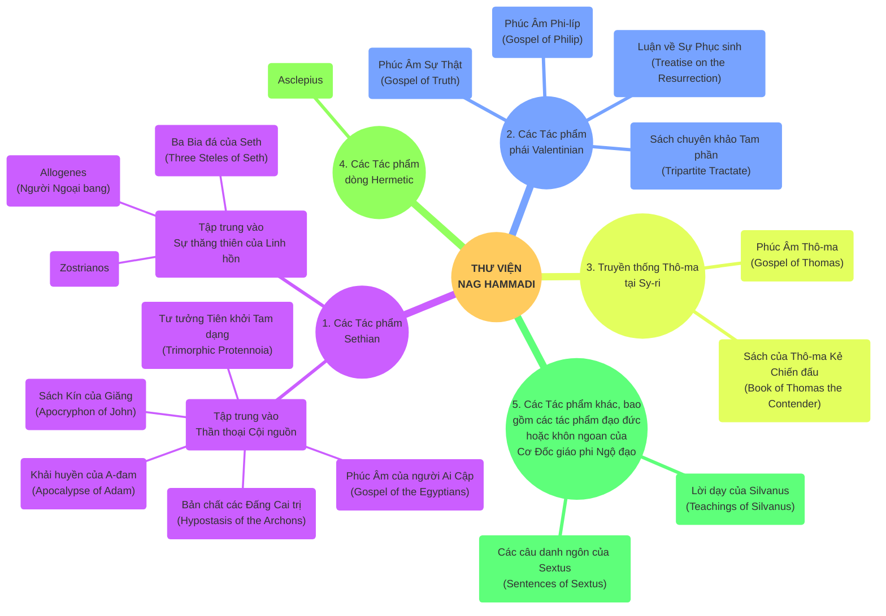

# Lịch sử Hội thánh Tập Một: Từ Đấng Christ đến Tiền Cải chánh

# Chương 5: Các Tà Giáo và Ly Giáo trong Thế Kỷ Thứ Hai

Ở [chương trước](https://thuyenphan.org/giao-duc-co-doc/nam-1/lich-su-hoi-thanh/chuong-04/), chúng ta đã xem xét các vấn đề bên ngoài mà Hội Thánh phải đối mặt trong thế kỷ thứ hai: sự chống đối từ chính quyền và từ các nhà hội. Chương này sẽ chuyển hướng sang những nan đề nội bộ, cụ thể là nỗ lực vạch ra các ranh giới để xác định thế nào là giáo lý và thực hành được chấp nhận. Cách dùng từ hiện đại phân biệt giữa **tà giáo** (heresy — sai trật về giáo lý căn bản) và **ly giáo** (schism — sự chia rẽ xuất phát từ các cá nhân, vấn đề kỷ luật và thực hành, mà không liên quan đến những sai lệch về tín lý nền tảng).

Như đã từng được nhận xét: "Những kẻ theo tà giáo thì sai lầm một cách tài tình; còn những kẻ ly giáo thì sai lầm một cách cố chấp." Tuy nhiên, trong ngôn ngữ cổ đại, các thuật ngữ *`hairesis`* ("tà giáo") [^1] và *`schisma`* ("ly giáo") [^2] ban đầu vốn không có sự phân định rạch ròi như vậy.

## I. MARCION

Có thể hơi không theo thông lệ khi chúng ta bắt đầu bằng việc tìm hiểu Marcion, nhưng lập trường thần học căn bản của ông dễ nắm bắt hơn nhiều so với những người theo thuyết Ngộ Đạo (*`Gnostics`*). Dĩ nhiên tôi không có ý nói rằng việc nghiên cứu về Marcion là dễ dàng hay không gặp chút nào khó khăn. Tuy nhiên, cách tiếp cận của ông dường như mang tính tôn giáo thuần túy, không bị pha trộn bởi những khuynh hướng suy diễn huyền bí như nhiều nhóm "Ngộ đạo".

Đầu tiên, Marcion bắt đầu từ việc cho rằng sự mặc khải Cơ Đốc mang một tính chất hoàn toàn khác biệt, và ông đã tự thiết lập nên một giáo hội mới (điều mà hầu hết các nhóm tà giáo sơ khai khác không hề làm). Giáo hội của ông đã trở thành một thế lực cạnh tranh trực tiếp với Hội Thánh lớn (Hội thánh chung) và tiếp tục tồn tại cho đến tận thế kỷ thứ năm.

Marcion có đủ những điểm tương đồng với nhóm người bị gắn mác là phái "Ngộ đạo" để trở thành một sự dẫn nhập phù hợp, nhưng ông cũng có đủ những điểm khác biệt để được xếp vào một phân loại của riêng mình.

Khi thảo luận về Cơ Đốc giáo gốc Do Thái (Jewish Christianity), chúng ta đã nhận thấy một số quan điểm cực đoan bắt nguồn từ những ảnh hưởng của Do Thái giáo; còn nơi Marcion, chúng ta lại bắt gặp những sự cực đoan đến từ phía dân Ngoại (Gentiles). Marcion đã giữ một lập trường kiên quyết chống lại cội rễ Do Thái của niềm tin Cơ Đốc.

  

  <em>Hình 1: Bức tiểu họa Sứ đồ Giăng (trái) cùng với Marcion xứ Sinope (phải, theo học giả Eisler), được lấy từ bản thảo MS 748 lưu giữ tại Thư viện Morgan (thế kỷ 11). Mặt của Marcion có thể đã bị những tu sĩ cạo nát hoặc bôi bẩn để thể hiện sự phẫn nộ, khinh bỉ và trừng phạt về mặt thần học đối với ông.</em>

### A. Tiểu sử

Marcion lớn lên tại Sinope, xứ Bông (Pontus), nơi cha ông được cho là một vị Giám mục. Ông là một thợ đóng tàu và đã thâu trữ được một khối tài sản đáng kể.

Những sự dạy dỗ sai trật từng bị lên án trong thư tín Tân Ước gửi cho Hội Thánh tại Cô-lô-se, cùng với các tư tưởng của phái Ảo Hình (Docetism) đang thịnh hành tại Tiểu Á có thể là một phần trong nền tảng tôn giáo của ông. Thêm vào đó, thái độ bài Do Thái gắn liền với cuộc nổi dậy [Bar Kokhba](https://thuyenphan.org/giao-duc-co-doc/nam-1/lich-su-hoi-thanh/chuong-03/#i-c%C3%A1c-nh%C3%A1nh-c%C6%A1-%C4%91%E1%BB%91c-gi%C3%A1o-do-th%C3%A1i) ở Palestine vào những năm 130 rất có thể đã tác động mạnh đến ông, mặc dù thế giới quan nền tảng của Marcion có lẽ đã được hình thành từ trước đó.

Ít lâu sau, Marcion đến Rô-ma và đã dâng cho Hội Thánh tại đây một khoản tiền lớn. Tuy nhiên, vào năm 144, giáo lý của ông bị bác bỏ, và toàn bộ số tiền đó đã được Hội Thánh hoàn trả lại. Sau sự kiện này, ông tiến hành thành lập một giáo hội đối lập; mà chỉ trong vài năm, đã trở nên lan rộng gần bằng chính Hội Thánh lớn (Hội Thánh chung). Sự giàu có cùng tài năng tổ chức của Marcion đã giúp ông thâu tóm được một số nhóm mang khuynh hướng Ngộ đạo đang nổi lên lúc bấy giờ. Tuy nhiên, cơ cấu tổ chức cũng như các hình thức thờ phượng trong cộng đồng của ông dường như vẫn giữ sự tương đồng với Hội Thánh lớn.

  

  <em>Hình 2: Quê hương của Marcion, tức xứ Bông (Pontus) & Tiểu Á (Asia Minor) là những địa danh rất quen thuộc trong Tân Ước. Sứ đồ Phi-e-rơ đã gửi thư tín thứ nhất của mình cho các tín hữu rải rác tại "xứ Bông (Pontus), Ga-la-ti (Galatia), Cáp-pa-đốc (Cappadocia), A-si (Asia), và Bi-thi-ni (Bythinia)" (I Phi-e-rơ 1:1).</em>

### B. Bộ "Quy Điển" Tân Ước

Marcion được biết đến nhiều nhất qua công trình của ông liên quan đến bản văn và quy điển (*`canon`*) của Tân Ước. **Ông đã chối bỏ hoàn toàn Cựu Ước**, không xem đó là Kinh Thánh cho Giáo hội của mình. Thay vào đó, ông ban hành một bộ Tân Ước riêng, bao gồm các phiên bản đã được chỉnh sửa của Phúc Âm Lu-ca và mười thư tín Phao-lô (ông cũng loại bỏ hoàn toàn các Thư tín Mục vụ [^3]).

Ông đã tùy tiện cắt bỏ hoặc thay đổi các câu Kinh Thánh, và thường dựa trên định kiến giáo lý của riêng mình để làm điều đó. Mặc dù vậy, bộ sưu tập của ông lại được xem là tập hợp cố định và lâu đời nhất của các sách Tân Ước từng được biết đến trong lịch sử [^4].

### C. Tác Phẩm "Antitheses" Và Sự Phản Biện Của Tertullian

Marcion đã chấp bút tác phẩm *`Antitheses`* (Các Phản Đề), trình bày những mâu thuẫn giữa Cựu Ước và Tân Ước, trong đó, hệ thống thần học của ông được phác họa một cách rõ nét. Ngày nay, chúng ta biết đến tác phẩm này một cách gián tiếp, chủ yếu là thông qua bộ sách phản biện gồm năm quyển của Giáo phụ Tertullian, mang tựa đề *Chống Lại Marcion* (*`Against Marcion`*).

  

  <em>Hình 3: Tertullian: Một trong những nhà thần học và biện giáo vĩ đại nhất của Hội Thánh Bắc Phi (nói tiếng La-tinh). Bộ sách Against Marcion của ông là một kiệt tác biện giáo, bảo vệ sự hiệp nhất không thể tách rời giữa Cựu Ước và Tân Ước, giữa Đấng Tạo Hóa và Đấng Cứu Chuộc.</em>

> Trong một trong những câu nói dí dỏm của mình, Tertullian đã mô tả Marcion là "con chuột vùng Pontus đã gặm nát các sách Phúc Âm" (*Against Marcion* 1.1).

### C. Thần học của Marcion

Thần học của Marcion từng được khắc họa như là một sự phóng đại thái quá về Phúc Âm ân điển của sứ đồ Phao-lô [^5]. Có một nhà phê bình đã đưa ra một câu nhận định nổi tiếng rằng, trong Hội Thánh cổ đại: "Chỉ duy nhất Marcion là hiểu được Phao-lô, nhưng chính ông lại hiểu sai về Phao-lô." Dù đây chắc chắn là một đánh giá mang tính phiến diện theo lăng kính của truyền thống Tin Lành, nhưng quả thật rất khó để nhìn nhận Marcion — hay bất kỳ nhân vật lịch sử nào — mà không bị chi phối bởi góc nhìn và định kiến của người nghiên cứu hiện đại.

Những điểm sau đây phản ánh các quan điểm nền tảng của Marcion, được đúc kết và tái hiện lại dựa trên những lời chỉ trích mà các đối thủ của ông trong Hội Thánh sơ khai đã nhắm vào ông:

1.  **Thuyết Nhị Nguyên về Đức Chúa Trời (`Dualism`):** Có hai vị thần — thần sáng tạo (thần của Cựu Ước) và thần cứu chuộc (thần của Tân Ước). Thuyết nhị nguyên của Marcion dường như không xuất phát từ các vấn đề siêu hình học phức tạp, mà là một sự suy luận bắt nguồn từ chính kinh nghiệm của con người về những nghịch lý và mâu thuẫn trong cuộc sống.
>
2.  **Sự Phân Lập Giữa Luật Pháp Và Ân Điển:** Luật pháp và sự phán xét thuộc về thần sáng tạo (Demiurge), còn sự cứu rỗi là công việc của Đức Chúa Cha (Đức Chúa Trời "Không Thể Biết" - Unknown God - hoặc "Xa Lạ" - Strange God).
>
3.  **Chối Bỏ Hoàn Toàn Cựu Ước:** Cựu Ước là sự mặc khải của thần sáng tạo và chỉ tiên báo về Đấng Mê-si của dân Do Thái (ông cho rằng người Do Thái đã hiểu Kinh Thánh của họ một cách chính xác). Chúa Giê-xu không phải là Đấng làm ứng nghiệm Cựu Ước (Ngài đến "không phải để làm trọn, mà là để ***phá hủy***" Luật pháp). Theo Marcion, vị thần của Cựu Ước là đấng giáng họa, tự mâu thuẫn với chính mình và thích thú với chiến tranh.
>
4.  **Quan Điểm Ảo Hình Về Đấng Christ:** Chúa Giê-xu được nhìn nhận theo Thuyết Ảo hình (*`Docetism`*); Ngài chỉ *dường như* đang chịu khổ. Mặc dù vậy, cái chết của Ngài được mô tả như một sự mua chuộc. Sự phục sinh của Chúa Giê-xu chỉ diễn ra ở khía cạnh linh hồn và tâm thần, và Ngài đã tự khiến mình sống lại. Quan điểm này một lần nữa dường như không bắt nguồn từ lập trường siêu hình học (ví dụ: cho rằng bản tính thần linh thì không thể chịu khổ đau), mà xuất phát từ cảm giác thông thường của con người: sự gớm ghiếc và ghê tởm xác thịt vì cho rằng nó là ô uế.

Sự ra đời về thể xác của Chúa Giê-xu là một chướng ngại vật đối với Marcion. Vì vậy, ông đã cho bắt đầu sách Phúc Âm của mình (cắt xén từ Phúc Âm Lu-ca) ở ngay chương 3 với lời tuyên bố rằng: Vào năm thứ mười lăm đời hoàng đế [Tiberius](https://thuyenphan.org/giao-duc-co-doc/nam-1/lich-su-hoi-thanh/chuong-01/#i-%C4%91%E1%BA%BF-ch%E1%BA%BF-la-m%C3%A3), Chúa Giê-xu "đã ***giáng xuống***" từ trời "đến thành Ca-bê-na-um xứ Ga-li-lê".
>
5.  **Phao-lô là sứ đồ chân chính duy nhất.** Mười Hai Sứ Đồ kia đã bị "Do Thái hóa", vì vậy Đức Chúa Cha phải kêu gọi Phao-lô để phục hồi lại Phúc Âm chân thật. Nhưng Marcion cũng cho rằng ngay cả các thư tín của Phao-lô cũng bị kẻ theo Do Thái giáo ngụy tạo và thêm thắt vào.
>
6.  **Marcion lập nền tảng đức tin của mình trên một sự mặc khải thành văn.** Tầm quan trọng và những hệ lụy của ông đối với quá trình hình thành Quy điển (Canon) sẽ được đánh giá chi tiết trong [chương tiếp theo](https://thuyenphan.org/giao-duc-co-doc/nam-1/lich-su-hoi-thanh/chuong-06/).
>
7.  **Chủ nghĩa khổ tu được nhấn mạnh mạnh mẽ.** Tình dục bị coi là điều gớm ghiếc. Nước lã được dùng để thay thế cho rượu nho trong Lễ Tiệc Thánh. Các thực phẩm liên quan đến sự sinh sản hữu tính đều bị cấm — bao gồm thịt và các sản phẩm từ sữa. Cá là nguồn protein duy nhất được phép. (Đến đây, các học giả hiện đại thường đặt câu hỏi: Không rõ Marcion nghĩ loài cá sinh sản bằng cách nào nhỉ? Hay vấn đề thực sự nằm ở việc ông muốn tránh né các loại thực phẩm thường được dùng trong việc cúng tế thần tượng ngoại giáo, chứ không hẳn là ghê tởm bản thân việc sinh sản?).

Chỉ những người không kết hôn mới được phép báp-têm, trừ khi họ đang ở cuối đời, vì vậy có hai cấp độ tín đồ trong các hội thánh Marcion: **người trọn vẹn** và **người chưa trọn vẹn**.
>
8.  **Những người theo Chúa Giê-xu không ở dưới luật pháp.** Sự cứu rỗi là duy bởi ân điển, và ân điển thì ***không cần*** đến bất kỳ luật pháp nào. Dẫu vậy, những quan điểm của ông về đức tin và tội lỗi lại thiếu đi chiều sâu như của Sứ đồ Phao-lô [^6].

### D. Ảnh hưởng của Marcion đối với Cơ Đốc Giáo

Tầm ảnh hưởng của Marcion là đáng kể, nhưng đã bị các học giả, nhà nghiên cứu của thế kỷ 20 đánh giá một cách quá cao. Trong đó, Hội Thánh phổ quát (catholic church) với **(1) Tín điều**, **(2) Quy điển** và **(3) Chức giám mục** vốn **không phải là sản phẩm** từ các phản ứng của họ đối với Marcion; nhưng các phản ứng này đã củng cố một số khuynh hướng vốn đã tồn tại từ trước. Do đó, chúng đã đẩy nhanh quá trình phát triển của các thực hành này.

Chủ nghĩa khổ tu của Marcion rất hấp dẫn như một sự trọn vẹn của Cơ Đốc giáo, và vì thế, nó là một trong những yếu tố ảnh hưởng đến sự khổ tu đối trong Cơ Đốc giáo chính thống (*`orthodox Christianity`*). Sự nhấn mạnh của ông vào cứu chuộc học (*`soteriology`*) mà bỏ qua vũ trụ luận (*`cosmology`*) đã trở thành một nan đề lớn đối với các giáo phụ của Hội Thánh phổ quát thời kỳ đầu (sẽ được bàn kỹ ở [chương 7](https://thuyenphan.org/giao-duc-co-doc/nam-1/lich-su-hoi-thanh/chuong-07/)).

### E. Phản Ứng Của Các Giáo Phụ

Việc Marcion cố tình tách rời Chúa Giê-xu Christ khỏi Đức Chúa Trời Tạo Hóa là một động lực lớn để các nhà tư tưởng chính thống bắt bắt tay vào việc hình thành nên giáo lý về Đức Chúa Trời Ba Ngôi (**Trinity**).

[Justin Martyr](https://thuyenphan.org/giao-duc-co-doc/nam-1/lich-su-hoi-thanh/chuong-04/#b-justin-martyr---m%E1%BB%99t-nh%C3%A0-bi%E1%BB%87n-gi%C3%A1o-ti%C3%AAu-bi%E1%BB%83u) đã kiên quyết giữ vững Cựu Ước bằng cách lập luận rằng Cựu Ước tiên tri về **hai lần đến khác nhau** của Đấng Mê-si — lần thứ nhất trong tình yêu thương và lần tiếp theo trong sự phán xét.

Tertullian thì khẳng định rằng ***Đức Chúa Trời là Đấng trọn vẹn cả sự công bình lẫn tình yêu thương***. Đức Chúa Trời phải thi hành sự kỷ luật trước khi bày tỏ tình yêu thương, và Đấng Sai Phái (Đức Chúa Cha) phải giãi bày uy quyền của Ngài (trong thời Cựu Ước) trước khi Đấng Được Sai Đi (Đức Chúa Con) có thể được nhân loại tiếp nhận. Ngược lại, vị thần của Marcion lại xuất hiện một cách quá đỗi đột ngột mà không hề có bất kỳ sự chuẩn bị hay báo trước nào trong dòng lịch sử.

Bên cạnh những yếu tố khác, việc Hội Thánh bác bỏ sự dạy dỗ của Marcion đã chứng tỏ một nhận thức vô cùng sâu sắc: **Hội Thánh không thể nào chối bỏ cội rễ Cựu Ước của mình.** Điều này mang ý nghĩa sống còn, bởi nó bảo vệ chân lý về sự hiệp nhất của Đức Chúa Trời (Đấng Tạo Hóa và Đấng Cứu Chuộc chỉ là Một) và sự tốt lành của công trình sáng tạo do tay Ngài làm nên.

  

  <em>Hình 4: Bức tranh Giáo phụ Justin Martyr của Theophanes người Crete vào thế kỷ 15. Dòng chữ Hy Lạp ở góc bên phải bức hình, "Ὁ ΦΙΛΟCΟΦΟς" (Nhà triết học). Chi tiết này rất quan trọng, bởi trước khi trở thành một trong những nhà biện giáo vĩ đại nhất của Cơ Đốc giáo sơ khai và chịu tử đạo, Justin vốn là một triết gia. Ông mặc áo choàng triết gia và luôn tin rằng Cơ Đốc giáo chính là "triết học chân chính nhất".</em>

### F. Sự so sánh với thuyết Ngộ Đạo (Gnostic)

Để nhìn nhận một cách khách quan, chúng ta có thể đặt Marcion lên bàn cân với phái Ngộ đạo (*`Gnosticism`*):

Những điểm **TƯƠNG ĐỒNG** (Điểm chung với phái Ngộ đạo):

  1. **Tin vào một Đức Chúa Trời "Không Thể Biết"**, một vị thần hoàn toàn tách biệt với Đấng Tạo Hóa.

  2. **Cổ xúy Thuyết Nhị Nguyên**, sự phân chia rạch ròi giữa vật chất (xấu xa) và tâm linh (tốt lành).

  3. **Giải nghĩa về Đấng Christ theo lăng kính của phái Ảo Hình** (Docetism - chối bỏ thân xác vật lý của Chúa Giê-xu).

  4. **Sự chối bỏ Cựu Ước**: Ông có thái độ tiêu cực, thù nghịch đối với Cựu Ước và Đức Chúa Trời của Cựu Ước.

  5. **Nguồn gốc của sự ác**: Ông cũng trăn trở sâu sắc về nguồn gốc của sự ác trong thế gian.

Những điểm **KHÁC BIỆT** (Điểm khiến Marcion trở thành một hệ phái riêng):

  1. **Bác bỏ thần thoại**: Ông không vướng vào những hệ thống suy diễn các thần linh, tinh tú phức tạp và hoang đường như phái Ngộ đạo.

  2. **Xây dựng cơ cấu**: Ông tự thiết lập một tổ chức giáo hội bài bản cho các môn đồ của mình.

  3. **Giải kinh theo nghĩa đen**: Ông tránh xa phương pháp giải nghĩa ngụ ngôn (allegorical interpretation) vốn rất được phái Ngộ đạo ưa chuộng.

  4. **Phê bình bản văn (Textual criticism)**: Chính vì đọc Kinh Thánh theo nghĩa đen, khi gặp những phân đoạn không phù hợp với giáo lý của mình, thay vì "ngụ ngôn hóa" chúng, ông chọn cách can thiệp trực tiếp vào bản thảo để cắt xén và chỉnh sửa.

## II. THUYẾT NGỘ ĐẠO (GNOSTICISM)

Ngay chính bản thân thuật ngữ "Thuyết Ngộ đạo" (*`Gnosticism`*) đã là một vấn đề phức tạp. Từ này bắt nguồn từ chữ *`gnosis`* trong tiếng Hy Lạp, dùng để chỉ sự hiểu biết đến từ kinh nghiệm trực tiếp có được thông qua sự tương giao hay tiếp xúc bề trong, tương phản với loại kiến thức chỉ thuần túy dựa trên lý thuyết hoặc dữ kiện khách quan.

Vào thế kỷ thứ hai, từng tồn tại một nhóm người tự xưng là *`Gnostikoi`* ("Những kẻ Ngộ đạo"), mang ý nghĩa là "những người có khả năng thấu đạt tri thức" và sau này được hiểu là "những kẻ có sự hiểu biết". Tuy nhiên, bắt đầu từ thời của Giáo phụ Irenaeus, các [nhà nghiên cứu và phản biện tà giáo (heresiologists) của Cơ Đốc giáo](https://thuyenphan.org/giao-duc-co-doc/nam-1/lich-su-hoi-thanh/chuong-04/#iii-c%C3%A1c-nh%C3%A0-bi%E1%BB%87n-gi%C3%A1o-c%C6%A1-%C4%91%E1%BB%91c-th%E1%BA%BF-k%E1%BB%B7-th%E1%BB%A9-hai) đã mở rộng phạm vi thuật ngữ này để gọi chung các nhóm đối lập bên trong Hội Thánh — những nhóm người dù có hệ thống tư tưởng khác biệt nhau, nhưng các giáo phụ vẫn nhận thấy họ có cùng một số điểm tương đồng về sự sai lạc để có thể gộp chung vào một tên gọi.

Do đó, chúng ta cần ghi nhớ rằng "Thuyết Ngộ đạo" đã trở thành một **thuật ngữ mang tính bao trùm** [^7]. Nó giống như một tâm trạng và thái độ đối với thế giới cùng cội nguồn của nó (và ngay cả những thái độ này cũng rất đa dạng), hơn là một giải pháp duy nhất cho những vấn đề mà một số người đang trăn trở. Nghĩa là, Thuyết Ngộ đạo mang dáng dấp của một **phong trào** (*movement*) nhiều hơn là một phương pháp tiếp cận nhất quán.

Phong trào tôn giáo này được đặc trưng bởi sự hiểu biết qua trực giác [^8] về cội nguồn, bản chất và định mệnh cuối cùng của bản chất thuộc linh bên trong con người.

### A. Vấn Đề Về Nguồn Sử Liệu: Lịch Sử Dưới Góc Nhìn Của "Người Chiến Thắng"

Việc nghiên cứu về Ngộ đạo thuyết từ lâu đã bị cản trở bởi một thực tế: những nguồn thông tin chính mà chúng ta có được đều đến từ các **tác giả chống tà giáo** của Hội Thánh. Những tác giả tiêu biểu nhất đã thảo luận về Ngộ đạo thuyết và lưu giữ lại các tư liệu của phái này bao gồm: Irenaeus, Clement thành Alexandria, Tertullian, Hippolytus và Epiphaniu. Bên cạnh đó, phái Ngộ đạo cũng được biết đến qua các tác phẩm chống lại họ của triết gia người Hy Lạp Plotinus.

Ngay cả khi các tác giả này có lưu giữ các trích dẫn từ các tác phẩm của phái Ngộ đạo, thì những trích dẫn ấy thường bị tách rời khỏi ngữ cảnh và luôn được sử dụng với mục đích **luận chiến phản bác**. Trong lịch sử, có một thực tế thường thấy là những kẻ thua cuộc chỉ được hậu thế biết đến thông qua lời miêu tả từ những đối thủ của họ; và hẳn chẳng mấy ai muốn mình chỉ được nhớ tới qua những gì kẻ thù nói về mình.

Để bổ sung cho những gì các giáo phụ chống tà giáo đã nói, chúng ta cũng có được một vài nguyên bản của phái Ngộ đạo được lưu giữ bằng tiếng Coptic, từ các văn bản **Hermetic** (Hermetic writings — một hình thức Ngộ đạo thuộc ngoại giáo), cùng các nguồn tư liệu từ phái **Manichaean** và **Mandaean** về sau (đây là hai phong trào chịu ảnh hưởng sâu sắc từ Thuyết Ngộ đạo thời kỳ đầu).

Tuy nhiên, cục diện nghiên cứu đã thay đổi hoàn toàn vào năm 1945 với sự kiện tìm thấy tại ***Nag Hammadi***, Ai Cập, một bộ sưu tập gồm mười hai tập thủ bản (*codices*) cùng một số trang rời khác. Những tài liệu này được viết vào thế kỷ thứ tư chứa hầu hết các tác phẩm Ngộ Đạo gốc trong bản dịch tiếng Coptic. Việc xuất bản các tác phẩm này qua các ấn bản được hiệu đính kỹ lưỡng cùng những bản dịch đáng tin cậy đã đưa chúng trở thành trọng tâm chính cho việc nghiên cứu về Thuyết Ngộ đạo cổ đại.

Bộ sưu tập Nag Hammadi có thể được phân loại khái quát thành năm nhóm tác phẩm văn học (Xem biểu đồ bên dưới). Trong số này, quan trọng nhất là hai nhóm đầu tiên:

  1. **Nhóm tư tưởng Ngộ đạo nguyên thủy:** Bao gồm những văn bản gần gũi hơn với tư tưởng "Ngộ đạo" gốc — thường được gán cho các tên gọi như phái "Sết" (*Sethian*) [^9], phái "Barbelo" (*Barbelognostic*) [^10], phái "Rắn" (*Ophite*) [^11], hoặc một vài tên gọi khác. Những nhóm này có thể đại diện cho các biến thể bên trong cùng một trường phái, hoặc là những hệ thống thần học hoàn toàn riêng biệt.

  2. **Nhóm trường phái Valentinus:** Bao gồm các văn bản xuất phát từ hệ thống tư tưởng của Valentinus (Valentinian school).

***Các ghi chép của các giáo phụ*** đã cung cấp cho chúng ta một phần nào đó về cấu trúc thần thoại của các hệ thống Ngộ đạo, nhưng chính ***các tài liệu Nag Hammadi*** mới được khám phá lại mang đến nhiều hơn về "tinh thần sống động" (*living spirit*) cũng như các phương pháp giải kinh mà phái này họ từng sử dụng. Hai loại nguồn sử liệu này đóng vai trò tương hỗ, giúp giải thích và làm sáng tỏ lẫn nhau.

  <em>Hình 5: Sơ đồ thư viện Nag Hammadi.</em>

### B. Vấn Đề Về Nguồn Gốc

Trước khi Thư viện Nag Hammadi được khám phá, đã có ba giả thuyết khác nhau về nguồn gốc của tư tưởng Ngộ đạo được đưa ra:

1. **Góc nhìn Tà giáo Cơ Đốc:** Quan điểm của các giáo phụ cho rằng Ngộ đạo thuyết là một tà giáo Cơ Đốc, xuất phát từ việc các Cơ Đốc nhân cố gắng giải thích đức tin của họ (cho chính mình và những người xung quanh) bằng các thuật ngữ triết học. Quan điểm này vẫn nhận được sự ủng hộ của giới học giả hiện đại.
>
2. **Góc nhìn Phong trào Phi Cơ Đốc (Ngoại giáo):** Một quan điểm trái ngược, được xướng lên bởi trường phái giải nghĩa Lịch sử Tôn giáo (history of religions school) và hiện vẫn có nhiều người ủng hộ. Quan điểm này cho rằng Ngộ đạo thuyết về bản chất là một phong trào phi Cơ Đốc (một số người truy nguyên nguồn gốc của nó về Ba Tư) — đại diện cho tâm trạng bi quan, chán chường và mang tính hỗn dung tôn giáo (*syncretistic*) của thời kỳ Hậu Cổ đại. Phong trào này đã tái cấu trúc lại một thế giới quan triết học dựa trên các thần thoại và các vị thần cổ xưa, rồi trong quá trình đó, nó khoác lên mình một ***lớp vỏ bọc Cơ Đốc giáo***. Đến lượt mình, lớp vỏ bọc này lại cung cấp một mô hình cho các trí thức Cơ Đốc giáo giải nghĩa đức tin của họ.
>
3. **Góc nhìn Nguồn gốc Do Thái giáo:** Một quan điểm ít phổ biến hơn cho rằng những suy đoán của phái Ngộ đạo bắt nguồn từ trong các vòng tròn Do Thái giáo, có lẽ là một nỗ lực nhằm tìm kiếm sự vĩnh cửu khi Vương quốc Đức Chúa Trời trì hoãn chưa đến. (Ví dụ: các "đời" (*`aeons`*) mang ý nghĩa là các "thời kỳ" thời gian trong văn học Khải Huyền đã bị biến đổi thành các thực thể không gian vũ trụ mà cấu thành nên cõi thần linh sung mãn (*`pleroma`*) trong thuyết Ngộ đạo). Quan điểm này đã nhận được sự ủng hộ mạnh mẽ trở lại nhờ vào các tài liệu Nag Hammadi.

Dường như trong cả ba cách giải thích đều có phần nào sự thật bên trong:

1. **Một số tư tưởng trong thuyết Ngộ đạo** quả thực đã có từ trước Cơ Đốc giáo, nhưng người ta chưa từng tìm thấy một hệ thống Ngộ đạo nào hoàn chỉnh tồn tại trước kỷ nguyên Cơ Đốc.
>
2. **Một số biểu hiện của thuyết Ngộ đạo**, đặc biệt là những nhóm bị các giáo phụ kịch liệt chống lại, đích thực là những tà giáo Cơ Đốc.
>
3. **Một số hệ thống Ngộ đạo** được biết đến từ các văn bản Nag Hammadi lại cho thấy sự gần gũi mật thiết với Do Thái giáo, nếu không muốn nói là chúng thực sự có nguồn gốc từ Do Thái.

Những tác phẩm Ngộ đạo tại Nag Hammadi không mang các đặc trưng Cơ Đốc giáo rõ rệt có thể ám chỉ rằng Ngộ đạo thuyết ban đầu là — hoặc cũng từng là — **một phong trào phi Cơ Đốc**; nhưng điều này không hẳn là bắt buộc. Bởi lẽ, nếu các Cơ Đốc nhân có thể đọc và sử dụng những tác phẩm này, thì họ cũng hoàn toàn có thể chính là những người đã chấp bút viết ra chúng.

Một quan điểm trung dung (*middle-of-the-road view*) cho rằng Ngộ đạo thuyết và Cơ Đốc giáo đã cùng nhau phát triển nhưng lại bắt nguồn từ những cội rễ hoàn toàn khác nhau. Hai phong trào này đã có những sự tương tác qua lại nhất định trong thế kỷ thứ nhất, và sau đó dần định hình thành những khuôn mẫu rõ rệt như hai tôn giáo độc lập, tách biệt vào thế kỷ thứ hai.

Một số tác giả đương đạiđã vạch ra sự rạch ròi giữa "Gnosis" (Ngộ Đạo) và "Gnosticism" (Thuyết Ngộ Đạo). Họ sử dụng thuật ngữ đầu tiên (*`Gnosis`*) cho một khái niệm rộng lớn hơn, thích hợp hơn cho lối suy nghĩ Ngộ Đạo; và thuật ngữ thứ hai (*`Gnosticism`*) cho các hệ thống tư tưởng đã phát triển một cách bài bản và hoàn thiện.

Như học giả **A. D. Nock** đã từng nhận định: *"Nằm ngoài phong trào Cơ Đốc giáo, vốn dĩ đã tồn tại một lối tư duy Ngộ đạo, nhưng chưa hề có một hệ thống tư tưởng Ngộ đạo nà. Chính sự xuất hiện của Chúa Giê-xu và niềm tin rằng Ngài là một Đấng siêu nhiên giáng thế đã làm **kết tủa** những yếu tố vốn dĩ như đang lơ lửng trong dung dịch trước đó"*.

Các hệ thống Ngộ Đạo phát triển đầy đủ mà chúng ta biết từ các giáo phụ và được phản ánh trong thư viện Nag Hammadi, bất kể tiền thân của chúng là gì, đều thuộc về **thế kỷ thứ hai**. Chính Thuyết Ngộ Đạo Cơ Đốc đã tạo ra tác động, vì những người theo thuyết Tân Platon coi Thuyết Ngộ Đạo là một sự sai lệch của Cơ Đốc giáo; đối với họ, những người Ngộ Đạo là những Cơ Đốc nhân với một loại yêu sách trở thành trí thức được đặc trưng bởi thuyết nhị nguyên nồng nhiệt và tính quy về con người (*anthropocentricity*) cực đoan.

Nói rằng Thuyết Ngộ Đạo có nguồn gốc phi Cơ Đốc thì nó không nhất thiết phải có trước Cơ Đốc giáo đâu. Bất kể các điểm chung giữa Cơ Đốc giáo và Thuyết Ngộ Đạo là gì, thì tuyên bố đầu tiên có thể được khẳng định, nhưng tuyên bố thứ hai thì chưa có gì xác nhận được.

  

  <em>Hình 6: Arthur Darby Nock (21/02/1902 – 11/01/1963) là một nhà kinh điển học và một nhà thần học người Anh, được coi là một học giả hàng đầu trong lịch sử tôn giáo. Ông là giáo sư tại Đại học Harvard từ năm 1930 cho đến khi qua đời.</em>

### C. Các Thành Phần Cấu Tạo Nên Thuyết Ngộ Đạo

Cuộc tranh luận về nguồn gốc đã chỉ ra những yếu tố góp phần hình thành nên các hệ thống Ngộ đạo phát triển hoàn thiện vào thế kỷ thứ hai. Các hệ thống này chứa đựng những thành phần của Do Thái giáo, ngoại giáo và cả Cơ Đốc giáo.

Nhiều sự suy đoán của phái Ngộ đạo có thể được giải thích là bắt nguồn từ những suy ngẫm về các chương đầu của sách Sáng Thế Ký. Một số phát triển trong Do Thái giáo có thể được xem là nền tảng cho sự xuất hiện của Thuyết Ngộ Đạo: ảnh hưởng của tư duy nhị nguyên, những suy đoán huyền bí (mật truyền), việc nhân cách hóa sự Khôn ngoan, hay các sinh vật trung gian được tìm thấy trong hệ thống thiên sứ học (*angelology*) đã phát triển. Do đó, hiện nay nhiều người đang tìm kiếm nguồn gốc của thuyết Ngộ đạo từ trong môi trường của Do Thái giáo không chính thống (*heterodox Judaism*), hoặc cụ thể hơn là từ những người Do Thái đang nổi loạn chống lại chính di sản tôn giáo của họ.

Triết học Hy Lạp cung cấp một thành phần lớn khác cho Ngộ đạo thuyết. Những ảnh hưởng của trường phái Tân Pythagore (Neopythagorean) có thể được nhìn thấy qua việc đánh giá tiêu cực về vật chất, các thực hành khổ tu, và những suy đoán về vũ trụ. Một số người gọi Ngộ đạo thuyết là **"chủ nghĩa Plato vượt ngoài tầm kiểm soát"** (*Platonism run wild*), bởi vì các tuyên bố của triết gia Plato đã được những kẻ Ngộ đạo phát triển thêm: một đấng tối cao xa vời vợi, cùng với quan niệm rằng linh hồn là bất tử nhưng lại bị cầm tù trong thể xác. CNhững sự tương đồng với ngoại giáo cũng có thể được tìm thấy trong văn chương Hermetic và các Sấm truyền Chaldaean (*Chaldaean Oracles*).

Nhiều điều trong Tân Ước, đặc biệt là trong các tác phẩm của Phao-lô và Giăng, được cho là dễ bị lợi dụng để giải nghĩa theo hướng Ngộ Đạo, đến nỗi một số học giả hiện đại coi các tác giả Tân Ước này là đang sử dụng tư duy Ngộ Đạo để hình thành các ý tưởng của riêng họ.

Mặc dù chúng ta vẫn tiếp tục thói quen nói về Thuyết Ngộ Đạo như thể nó là một thực thể đơn lẻ, nhưng thực tế hiếm khi lại như vậy. Mỗi giáo sư Ngộ đạo đã lấy những thành phần cấu tạo này và nhào nặn chúng lại với nhau theo một lối tư duy Ngộ đạo để xây dựng nên hệ thống của riêng mình.Do đó, có một sự đa dạng rất lớn trong các chi tiết của những hệ thống thuộc các giáo sư Ngộ đạo khác nhau. Ngộ đạo thuyết thực chất là một tập hợp của hàng loạt những phản ứng mang tính cá nhân đối với hoàn cảnh tôn giáo, được đưa ra bởi những giáo sư vốn không hề coi bản thân mình là những kẻ lập dị.

  

  <em>Hình 7: Nhà triết học Hy Lạp Plato, bức tượng bán thân bằng đá cẩm thạch được sao chép từ bản gốc thế kỷ thứ 4 trước Công nguyên; hiện đang được trưng bày tại Bảo tàng Capitoline, Rome.</em>

### D. Đặc Điểm Chung Của Các Thần Thoại Ngộ Đạo

Mỗi giáo sư Ngộ đạo đều sở hữu một hệ thống tư tưởng của riêng mình để diễn giải về thực tại. Điều thực sự gắn kết mỗi cộng đồng Ngộ đạo lại với nhau chính là thần thoại về nguồn gốc của họ, ý thức về bản sắc nhóm, và một thứ ngôn ngữ nội bộ (in-group language).

Các đặc điểm chính của những hệ thống thần thoại khác nhau này được tóm lược như sau:

  1. **Thực thể thần linh nguyên thủy** đã sản sinh ra các nguyên lý/thực thể thuộc linh khác;

  2. **Một "lỗi lầm"** đã xảy ra trong thế giới thần linh, thuộc linh;

  3. **Hậu quả của lỗi lầm** đó là vật chất (matter) bắt đầu hiện hữu;

  4. **Một phần của bản tính thuộc linh thuần khiết** đã được gieo cấy vào trong (một số) linh hồn;

  5. **Một "đấng cứu chuộc"** đã xuất hiện để bày tỏ con đường giải thoát khỏi thế giới vật chất dành cho yếu tố thần linh này;

  6. **Linh hồn sẽ đi xuyên qua các cõi của những kẻ cai trị thế gian** trong hành trình quy hồi về quê hương thuộc linh của mình.

Nỗ lực của phái Ngộ đạo nhằm giải thích vấn đề về sự ác đã giả định một sự sa ngã ngay bên trong thế giới thần linh, tức là bên trong chính thần tính. Nỗ lực "đề cao" vấn đề cái ác này là một điều đáng chú ý, nhưng hoàn toàn không thỏa đáng để trở thành câu trả lời cho một trong những câu hỏi triết học khó nhằn nhất của con người.

Cách thức giải quyết câu hỏi này là một biểu hiện của việc phái Ngộ đạo, đặc biệt là trường phái Valentinus, sử dụng khái niệm mang một nửa tính thi ca, một nửa tính triết học về **"sự tương ứng siêu hình"** (*metaphysical correspondence*). Bằng cách áp dụng quan điểm của triết gia Plato cho rằng các thực tại trên đất chỉ là những bản sao mô phỏng của thế giới Ý niệm (*world of Ideas*), những người Ngộ Đạo xem các thành phần cấu tạo nên cõi thần linh *pleroma* (sự đầy trọn) hoàn toàn tương đương với tổng thể bản tính thuộc linh của nhân loại. Họ cho rằng luôn có một "bản sao trên trời" (*heavenly counterpart*) cho mỗi linh hồn. Theo đó, các câu chuyện lịch sử trong sách Phúc Âm đã bị họ đọc và diễn dịch như những hình ảnh phản chiếu của một vở kịch đang diễn ra trong thế giới thiên thượng.

> Do vậy, bất chấp việc mang đậm tính nhị nguyên, *"Tri thức (gnosis) của Ngộ đạo thuyết bao hàm sự đồng nhất mang tính thần linh giữa kẻ nhận thức (chính người Ngộ đạo), đối tượng được nhận thức (bản thể thần linh của cái tôi siêu việt bên trong người đó), và phương tiện để qua đó người ta nhận thức (gnosis được xem như một năng lực thần linh tiềm tàng cần được đánh thức và hiện thực hóa)"* (theo học giả Bianchi).

### E. Các Giáo Sư Tà Giáo Chủ Chốt

| Tên | Thời gian | Địa điểm |
| --- | --- | --- |
| **Simon Magus** | Thế kỷ thứ nhất | Samaria và Rome |
| **Menander** | Cuối thế kỷ thứ nhất | Samaria và Antioch |
| **Cerinthus** | Cuối thế kỷ thứ nhất | Tiểu Á (Asia Minor) |
| **Saturninus** | Đầu thế kỷ thứ hai | Antioch |
| **Carpocrates** | Đầu thế kỷ thứ hai | Alexandria |
| **Basilides** | Đầu thế kỷ thứ hai | Alexandria |
| **Valentinus** | Thế kỷ thứ hai | Alexandria và Rome |
| **Ptolemy** | Thế kỷ thứ hai | Rome? |
| **Theodotus** | Thế kỷ thứ hai | Alexandria? |
| **Heracleon** | Thế kỷ thứ hai | Italy? |

#### 1. Simon Magnus Và Nguồn Gốc Sa-ma-ri

Các trước giả chống tà giáo của Hội Thánh đầu tiên đã truy nguyên nguồn gốc của "Ngộ đạo thuyết" về **thuật sĩ Si-môn** (Simon Magus), người được họ mệnh danh là "cha đẻ của mọi tà giáo".Tuy nhiên, bản gia phổ về tà giáo này do các giáo phụ lập ra trông có vẻ khá khiên cưỡng, do chịu ảnh hưởng từ nhiều danh sách kế thừa khác nhau vốn rất thịnh hành trong thời cổ đại. Hơn nữa, lời tường thuật trong sách Công Vụ Các Sứ Đồ chương 8 không hề cho thấy Si-môn đã nắm giữ bất kỳ sự dạy dỗ nào mang đặc trưng "Ngộ đạo" đặc biệt nào.

Có thể đã xảy ra một sự nhầm lẫn giữa nhân vật Si-môn trong Công Vụ 8 và một Si-môn khác, người thực sự là một kẻ Ngộ đạo; hoặc cũng có thể sách Công Vụ 8 đã không kể lại toàn bộ bối cảnh câu chuyện; hoặc bản thân Si-môn lúc bấy giờ đang trên đà trở thành một kẻ Ngộ đạo, và các môn đồ của ông sau này mới thực sự đi theo thuyết Ngộ đạo.

Dù thế nào đi nữa, việc gán ghép Ngộ đạo thuyết cho Simon có thể chỉ ra một nguồn gốc từ xứ Sa-ma-ri, một hướng đi mà một số học giả hiện nay đang xem xét. Những sự dạy dỗ mà sau này được cho là của Si-môn quả thực sở hữu những đặc điểm của các hệ thống Ngộ đạo, ở chỗ nó bao gồm một sự sa ngã khỏi cõi thần linh và sự giáng hạ của một quyền năng thiên thượng (chính là bản thân Si-môn) để mang lại sự cứu rỗi.

  

  <em>Hình 8: Bức phù điêu chạm khắc hình ảnh Simon Magus trên cổng Miègeville của vương cung thánh đường Saint-Sernin ở Toulouse.</em>

#### 2. Cerinthus Và Thuyết Thiên Hy Niên

Có những ghi chép dường như mâu thuẫn nhau về sự dạy dỗ của **Cerinthus**, người được tường thuật là đã bị Sứ đồ Giăng chống đối quyết liệt tại Ê-phê-sô. Ghi chép lâu đời nhất còn tồn tại (của Giáo phụ Irenaeus) đặt Cerinthus vào quỹ đạo của thuyết Ngộ Đạo với những lập luận sau:

* **Một Quyền Năng thấp hơn** — chứ không phải Đức Chúa Trời Tối Cao — đã tạo ra thế giới.
* **Chúa Giê-xu chỉ là con trai ruột của Giô-sép và Ma-ri**, nhưng Ngài đã vượt trội hơn những người khác về sự công bình và khôn ngoan.
* **"Đấng Christ thần linh"** đã giáng xuống trên Ngài dưới hình chim bồ câu tại lễ báp-têm, và đã bay đi mất trước khi Ngài bị đóng đinh; do đó, Đấng Christ vẫn luôn là một thực thể thuộc linh không thể chịu khổ.

Một báo cáo muộn hơn một chút đã cho rằng Cerinthus thành một giáo sư dạy về thuyết thiên hy niên Do Thái và thậm chì còn gán sách Khải Huyền cho ông.. Một cách để dung hòa sự mâu thuẫn rõ rệt trong những bức tranh khắc họa về Cerinthus này là: ông đã "đi trước" Marcion bằng cách nói rằng sự mong đợi của người Do Thái về một vương quốc cứu thế trên trái đất là một cách đọc hiểu đúng đắn các lời tiên tri Cựu Ước; thế nhưng, Đấng Christ lại bày tỏ cho chúng ta một người Cha "không biết" và một sự cứu rỗi thuộc linh.

  

  <em>Hình 9: Bản khắc đồng "Giăng và kẻ tà giáo Cerinthus trong nhà tắm" (John and the heretic Cerinthus in the bathhouse) được thực hiện bởi nghệ nhân người Hà Lan Jan Luyken vào năm 1701. Giai thoại này được Giáo phụ Irenaeus ghi chép lại trong tác phẩm Adversus Haereses (Chống lại các tà giáo), dựa trên lời kể của Polycarp — một môn đồ trực tiếp của Sứ đồ Giăng.</em>

#### 3. Saturninus

Irenaeus đã vạch ra một dòng dõi dẫn từ Simon đến Menander, Saturninus và Basilides. Đối với **Saturninus**, ông gán cho một bản tóm tắt gọn gàng tương ứng với các yếu tố chính của thần thoại Ngộ Đạo cơ bản:

* **Người Cha "không biết"** đã tạo ra các cấp độ khác nhau của các thực thể thiên sứ.
* **Bảy trong số các thiên sứ này** đã tạo ra thế giới và con người đầu tiên.
* **Đức Chúa Trời của người Do Thái** là một trong những thiên sứ này.
* **Đấng Christ**, là vô hình, chỉ đến trong hình dạng để lật đổ Đức Chúa Trời của người Do Thái và cứu những con người tốt lành.
* **Những người theo ông** từ bỏ hôn nhân và sinh sản, và ăn chay.

#### 4. Carpocrates: Sự Luân Hồi Và Lối Sống Phóng Túng

Carpocrates cũng khẳng định rằng thế giới được tạo dựng bởi các thiên sứ, những kẻ thấp kém hơn rất nhiều so với Đức Chúa Cha không hề được thọ tạo (*the unbegotten Father*). Chúa Giê-xu cũng được sinh ra từ Giô-sép giống như bao người khác, nhưng bởi sự thanh sạch của linh hồn Ngài, quyền năng từ trên cao đã giáng xuống trên Ngài, ban cho Ngài khả năng thoát khỏi những kẻ cai trị thế gian. Những linh hồn nào giống với linh hồn của Chúa Giê-xu cũng sẽ nhận được quyền năng để thoát khỏi những kẻ cai trị thế gian, và thậm chí có thể trở nên mạnh mẽ hơn cả các môn đồ của Chúa Giê-xu, hay thực chất là hơn cả chính Ngài.

Những người theo Carpocrates tự gọi mình là "những người Ngộ đạo" (*`Gnostics`*), nhưng họ lại có những đặc điểm hoàn toàn khác biệt so với những nhóm Ngộ đạo khác. Họ dạy về sự luân hồi, và trái ngược với sự khổ tu liên quan đến tình dục (đặc trưng của những người Ngộ Đạo khác), họ là những người phóng túng, đắm chìm trong sự suy đồi đạo đức về tình dục. Con trai của Carpocrates, **Epiphanes** thậm chí còn biện minh cho sự lăng nhăng dựa trên cơ sở của một "quy luật tự nhiên" – quy luật cho rằng mọi thứ đều là tài sản chung.

#### 5. Basilides: Sự Phức Tạp Của Vũ Trụ Luận Và Sự Tráo Đổi Trên Thập Tự Giá

Basilides có một vũ trụ luận phức tạp hơn nhiều so với các giáo sư khác – những người đã tìm cách kết hợp Cơ Đốc giáo với những sự suy đoán của phái Ngộ đạo.

Đức Chúa Cha không hề được thọ tạo (hay "Đức Chúa Trời không tồn tại", tức là Đức Chúa Trời vượt lên trên mọi khái niệm tồn tại, theo một phiên bản khác) đã sản sinh ra các phẩm chất thuộc linh khác nhau, và từ những phẩm chất đó, Ngài tạo ra "các quyền năng, chủ quyền và thiên sứ", mỗi loại gồm một nhóm cai quản cho toàn bộ ***365 tầng trời***.Trong số các thực thể thiên thượng này có một ***Archon*** (Kẻ cai trị), kẻ chính là Đức Chúa Trời của người Do Thái.

Đức Chúa Cha không hề được thọ tạo đã sai Con đầu lòng của Ngài là Tâm trí (hay Trí tuệ), đến để giải phóng những ai tin nhận Ngài khỏi quyền lực của những tạo vật đã tạo dựng nên thế giới. Vị sứ giả này tương ứng với Chúa Giê-xu, Đấng đã làm nhiều phép lạ nhưng lại không hề chịu khổ hình.

Simon người Cyrene, kẻ đã vác thập tự giá cho Chúa Giê-xu, vì sự vô tri của bọn hành quyết, nên đã bị đóng đinh một cách ngu dốt thế chỗ Ngài; trong khi Chúa Giê-xu, mang hình dạng của Simon, đứng bên cạnh cười nhạo bọn họ, rồi thăng thiên một cách vô hình về cùng Đức Chúa Cha – Đấng đã sai phái Ngài.

Sự cứu rỗi chỉ dành cho linh hồn, chứ không dành cho thể xác. Trong những thời kỳ bắt bớ, các môn đồ của ông sẵn sàng chối bỏ việc mình là Cơ Đốc nhân, bởi vì họ tin rằng bản thân mình, cũng giống như các thiên sứ, không thể nào phải chịu đau khổ.

  

*Hình 10: Theo thần học của Basilides, Kẻ cai trị (Archon) vĩ đại đứng đầu 365 tầng trời có tên là **Abraxas**. Cái tên này không phải ngẫu nhiên mà được chọn. Trong hệ thống số học của bảng chữ cái Hy Lạp (gematria), tổng giá trị các chữ cái của từ A-B-R-A-X-A-S cộng lại bằng chính xác 365 (A=1, B=2, R=100, A=1, X=60, A=1, S=200). Những viên đá quý Abraxas này được các tín đồ Ngộ đạo sử dụng phổ biến như những lá bùa hộ mệnh mang sức mạnh thần bí.*

#### 6. Valentinus: Thiên Tài Tôn Giáo Và Hệ Thống Ngộ Đạo Tinh Vi

Trong số những người mà các giáo phụ gọi là "kẻ Ngộ đạo", giáo sư có ảnh hưởng nhất cho đến nay là thiên tài tôn giáo Valentinus, người đóng vai trò là một nhà cải cách Cơ Đốc đối với thần học Ngộ đạo. Valentinus được giáo dục ở Alexandria, và sau khi giảng dạy ở đó, ông đến Rô-ma, nơi ông hoạt động rất tích cực trong Hội Thánh. Theo các ghi chép, do thất vọng vì không đạt được kỳ vọng được bầu làm giám mục và vấp phải quá nhiều sự chống đối đối với giáo lý của mình, ông đã lui về ở ẩn và biệt tăm.

Có rất ít những tác phẩm chắc chắn là của Valentinus còn sót lại, nhưng nhiều học giả cho rằng cuốn *Phúc Âm Lẽ Thật* (Gospel of Truth) được tìm thấy tại Nag Hammadi chính là một bài giảng của ông. Valentinus mang đậm chất "Cơ Đốc" một cách rõ rệt hơn so với các bậc tiền bối Ngộ đạo của mình, nhưng đồng thời ông cũng lồng ghép ngôn ngữ triết học của Plato trọn vẹn hơn họ.

Hơn nữa, chủ nghĩa thần bí của Valentinus đã sửa đổi lại chủ nghĩa thần bí Ngộ Đạo bằng cách định nghĩa sự cứu rỗi đến thông qua *`gnosis`* – tức là sự nhận biết (hoặc sự quen thuộc mang tính trải nghiệm) về đấng cứu thế, về bản ngã, và về Thượng Đế.

Thần thoại của ông về nguồn gốc thế giới không bắt đầu với một *đơn tử* nguyên thủy (*`monad`* - một thực thể đơn lẻ tối hậu) mà bắt đầu bằng một cặp nguyên lý đầu tiên: đó là **Đấng Không Thể Diễn Tả** (hay Vực Thẳm - Depth) và **Sự Tĩnh Lặng** (Silence). Bằng cách sử dụng ngôn ngữ nông nghiệp (sự gieo giống và sinh nở), Valentinus cho biết cặp đôi này đã sản sinh ra các cặp nhị nguyên khác để cấu thành nên ***bộ Tám*** (*`ogdoad`*) đầu tiên. Từ ***bộ Tám*** này, đã xuất phát thêm hai mươi hai quyền năng khác, tạo thành tổng cộng ba mươi *`aeon`* (thực thể thần linh) trong *`pleroma`* (sự sung mãn [của vũ trụ thuộc linh]).

Một trong những *`aeon`* này (được gọi là Sophia, nghĩa là Sự Khôn Ngoan trong tiếng Hy Lạp, theo các phiên bản khác của thần thoại) đã nổi loạn và sinh ra Đấng Christ cùng với một cái bóng (chính là vật chất).Đấng Christ sau đó đã quay trở lại cõi *`pleroma`*, còn "người mẹ" nổi loạn đã phát ra Demiurge (Đấng Tạo Hóa).

Chúa Giê-xu là một sự phát xuất từ Đấng Christ hoặc từ các *`aeon`* khác thuộc cõi *`pleroma`*. Do đó, các thực thể trên đất như nhân loại và hội thánh đều được xem là những hình ảnh phản chiếu của các thực tại thuộc linh.

Những người theo Valentinus được cho là đã chia thành hai trường phái:

* **Trường phái phương Tây** (ví dụ: Heracleon và Ptolemy).
* **Trường phái phương Đông** (ví dụ: Theodotus và Bar Daisan hoặc Bardesanes).

Những đóng góp ban đầu của riêng họ cho việc giải thích Kinh Thánh là minh chứng rõ nét cho sự lỗi lạc của Valentinus với tư cách là một giáo sư xuất sắc. Heracleon có lẽ đã viết cuốn sách giải kinh đầu tiên cho một sách sách Tân Ước, đó là Phúc Âm Giăng. Trong khi đó, Ptolemy đưa ra một **hệ thống ba phần** (three-fold scheme) để giải nghĩa Luật pháp Cựu Ước: một phần đến từ chính Đức Chúa Trời, một phần từ Môi-se, và một phần từ các trưởng lão.

Các giáo phụ của Hội Thánh đã để lại những bản báo cáo đầy đủ hơn về các thế hệ kế thừa của ông so với những ghi chép về chính bản thân Valentinus.

  

  <em>Hình 11: Sơ đồ hệ thống 30 Aeon trong cõi Pleroma của Valentinus.</em>

#### 7. Các Giáo sư Nữ

Rất khó để tìm sự liên hệ giữa một hệ thống trí tuệ đến những thực tế xã hội mà nó vận hành, và điều này đặc biệt đúng với Thuyết Ngộ Đạo. Ví dụ, sự bình đẳng của phụ nữ trong các cộng đồng Ngộ Đạo không nhất thiết phải bắt nguồn sự nổi bật của các yếu tố nữ tính trong *`pleroma`* của những người Ngộ Đạo.

Tuy nhiên, có những nữ giáo sư nổi bật trong một số giới Ngộ Đạo: ví dụ, một người phụ nữ không tên của giáo phái Cainite, mà bà đã khiến Tertullian viết *Về Báp-têm* (On Baptism) vì sự chê bai của bà về phép báp-têm bằng nước. Và Philoumene, một nữ tiên tri và giáo sư có ảnh hưởng đến môn đồ của Marcion là Apelles.

Tuy nhiên, không có bất kỳ sự nhất quán nào về sự cởi mở lớn hơn đối với vai trò lãnh đạo của phụ nữ giữa các hội thánh "tà giáo", cũng như không có sự thù địch nhất quán nào đối với phụ nữ với tư cách là phụ nữ giữa những hội thánh "chính thống".

### F. Các Thần Thoại Ngộ Đạo Mẫu Về Sự Sáng Tạo và Cứu Rỗi

Hiện còn lưu lại hai bản diễn giải chi tiết về hệ thống tư tưởng Ngộ Đạo cơ bản:

1. **Một bản thuộc phái "Seth"**, do chính một tín đồ chấp bút và được tìm thấy trong cuốn *Apocryphon of John* (Irenaeus cũng biết đến một phiên bản hơi khác của tài liệu này).

2. **Bản còn lại thuộc phái Valentinian**, tức hệ thống của Ptolemy, cũng được Irenaeus mô tả rất chi tiết.

Theo *Apocryphon of John*, Nguyên Lý Đầu Tiên, tức "Cha của Mọi Sự", thông qua Nguyên Lý Thứ Hai, "Barbelo", đã khiến cho thế giới linh thiêng sung mãn bởi các thực thể phát xuất từ Ngài. Kẻ tạo dựng nên thế giới vật chất này là một Thợ Tạo tác gian ác, tên là "Yaldabaoth". Công cuộc tạo dựng A-đam diễn ra qua hai giai đoạn: thoạt tiên, A-đam được tạo nên chỉ thuần túy bằng linh hồn; đến giai đoạn thứ hai, một lớp vỏ vật chất mới bao bọc lấy ông.

*Apocryphon of John* vốn đã là một phiên bản mang sắc thái Cơ Đốc của thuyết Ngộ Đạo, vì một trong các thực thể thuộc linh được nhắc đến là “Đấng Christ” tiền hữu, và nội dung tác phẩm được trình bày như là sự mặc khải của Chúa Giê-xu sau khi Ngài phục sinh; tuy nhiên, đấng mặc khải đích thực trong đó lại là Barbelo.

Sự giải trình của Ptolemy về hệ thống Ngộ đạo theo phái Valentinus thì mang tính chất “Cơ Đốc” một cách rõ ràng hơn, dù vẫn là “không chính thống,” và tìm cách đưa ra những lời giải thích có trật tự hơn về bức tranh của thế giới thuộc linh.

Sự phân đôi (Doubling) giữa Đấng Christ và sự Khôn Ngoan (Wisdom) ở thượng giới và hạ giới được mô tả:

  * **Đấng Christ thượng giới** là sự phát xuất từ Trí Tuệ (Intellect) và có Đức Thánh Linh là phối ngẫu.

  * **Đấng Christ hạ giới**, hay Giê-xu, còn gọi là Đấng Cứu Thế, là sự phát xuất từ tất cả các *aeon*; Ngài đã giáng trên con người Giê-xu, là người được Ma-ri sanh hạ.

Sự Khôn Ngoan thượng giới, Sophia, vốn là một trong ba mươi*aeon*. Lòng khao khát mãnh liệt của bà đối với Vực Thẳm (tức Người Cha toàn hảo) đã sản sinh ra Sự Khôn Ngoan hạ giới, gọi là Achamoth. Achamoth lại sinh ra Thợ Tạo Tác (Demiurge - kẻ dựng nên thế gian này) và cuối cùng trở thành phối ngẫu [^12] của Giê-xu, Đấng Cứu Thế.

Con người được phân chia thành ba loại:

  * **Hạng người xác thịt (Material):** Những kẻ này chắc chắn sẽ bị hư mất.

  * **Hạng người tâm hồn (Psychics):** Tức là các Cơ Đốc nhân bình thường.

  * **Hạng người thuộc linh (Spirituals):** Tức là các Cơ Đốc nhân theo phái Valentinus.

Hai nhóm sau sẽ nhận lãnh những phương cách cứu rỗi khác biệt nhau.

  

*Hình 12: Hình tượng **Yaldabaoth (Đấng Tạo Hóa ngộ nhận / Demiurge)**. Người Ngộ đạo tin rằng Yaldabaoth là một "sản phẩm lỗi" được sinh ra khi Sophia (Sự Khôn Ngoan) tự ý phóng xuất sự sống mà không có sự phối hợp của Thượng Đế tối cao. Vì bị tách biệt khỏi ánh sáng chân lý, Yaldabaoth vô minh và kiêu ngạo, lầm tưởng mình là vị thần duy nhất ("Ta là Đức Chúa Trời, ngoài ta ra không có thần nào khác"). Họ đồng nhất Yaldabaoth với Đức Chúa Trời của Cựu Ước, kẻ đã giam cầm linh hồn thiêng liêng của con người vào trong ngục tù thể xác.*

### G. Các Sai Lầm Giáo Lý và Ý Nghĩa Của Thuyết Ngộ Đạo

Trái với khuynh hướng nghiên cứu đương đại thường cho rằng Cơ Đốc giáo trong giai đoạn sơ khai rất đa dạng và thiếu nhất quán (vấn đề này sẽ được bàn kỹ hơn ở phần sau), thì thái độ phản kháng của nhiều Cơ Đốc nhân thế kỷ thứ hai đối với những tà thuyết được đề cập trong chương này lại minh chứng một điều ngược lại: có những giáo lý cốt lõi đã được thừa nhận chung là nền tảng không thể thay đổi của đức tin Cơ Đốc.

Những người sau này được xác lập là Cơ Đốc nhân chính thống đã đi đến kết luận rằng phái Ngộ đạo (*`Gnostics`*), bao gồm cả phái Valentinus, đã chối bỏ những tín lý nền tảng sau đây:

1.  **Sự đồng nhất giữa Đấng Tạo Hóa** (người mà phái Ngộ đạo coi là một nhân vật thấp kém và nhập nhằng về đạo đức) với Đức Chúa Trời tối cao duy nhất.
>
2.  **Sự tốt lành của trật tự thọ tạo trong vũ trụ** (trong khi phần lớn phái Ngộ đạo xem vật chất là xấu xa).
>
3.  **Sự nhập thể trọn vẹn của Đấng Christ** (mặc dù phái Ngộ đạo có nhiều biến thể khác nhau về mối liên hệ giữa Đấng Christ thần tánh và con người Giê-xu).
>
4.  **Sự mặc khải thông qua các sự kiện lịch sử** (thay vì qua những huyền thoại suy diễn và các truyền thống bí truyền).
>
5.  **Sự cứu chuộc nhờ huyết trên thập tự giá** (thập tự giá bị coi là hình bóng ẩn dụ ngay cả trong phái Valentinian).
>
6.  **Sự phục sinh của thân xác** (chứ không chỉ đơn thuần là sự sống lại của linh hồn).

Không có gì ngạc nhiên khi những người tiên phong đặt nền móng cho thần học chính thống đã quyết liệt bác bỏ những sự dạy dỗ bị xem là chối bỏ các tín lý này.

Bất chấp những gì phe đối lập của họ nhận thấy là những sai lạc nghiêm trọng giáo lý căn bản, tư tưởng Ngộ Đạo vẫn tỏ ra đầy sức hấp dẫn đối với nhiều người. Các Cơ Đốc nhân theo phái Ngộ đạo tiêu biểu cho nỗ lực giải nghĩa đức tin dưới lăng kính của bối cảnh triết học và tôn giáo đương thời, mà qua đó đã vật lộn với những nan đề mà họ nhận thấy trong bản chất của thế gian và kiếp nhân sinh.

Chính vì những lo ngại này mà phái Valentinian đã có ảnh hưởng đặc biệt đến các nhà thần học Cơ Đốc chính thống tại Alexandria trong quá trình xây dựng hệ thống thần học của họ. Chúng ta thường học hỏi từ chính những đối thủ của mình, đôi khi theo những cách mà bản thân không hề hay biết. Trong nỗ lực biện bác những tư tưởng sai lạc, tư duy thần học của chính chúng ta lại được nâng cao nhờ việc tiếp thu và chắt lọc những yếu tố từ chính các quan điểm mà mình đang khước từ.

Hơn nữa, Thuyết Ngộ Đạo cho thấy một mối quan tâm đến sự cứu rỗi. Mặc dù phương tiện để đạt được điều này là thông qua tri thức, Thuyết Ngộ Đạo như một tôn giáo cứu chuộc đã minh chứng cho nhu cầu của linh hồn con người: họ cần một điều gì đó vượt trổi hơn thế gian này để thỏa lấp những khát khao sâu thẳm của mình.

### H. Bài Học Từ Cuộc Đấu Tranh Với Thuyết Ngộ Đạo

Mặc dù văn hóa và triết học luôn có phần nào tác động đến cách Cơ Đốc giáo được bày tỏ, nhưng Ngộ đạo thuyết là một minh chứng sống động về sự nguy hiểm khi cho phép một hệ tư tưởng "ngoại lai" chi phối và định đoạt chính cốt lõi của niềm tin Cơ Đốc.

Rủi ro là điều tất yếu mà chúng ta phải đối diện khi nỗ lực đem đức tin Cơ Đốc đi vào bất kỳ nền văn hóa nào. Tuy nhiên, hậu quả từ sự vay mượn thái quá như vậy là một lời cảnh tỉnh nghiêm khắc: chớ để nỗ lực truyền tải sứ điệp biến chất thành sự thỏa hiệp và chấp nhận các tư tưởng thế gian. Mối đe dọa của Ngộ đạo thuyết không chỉ dừng lại ở việc tấn công vào hệ thống tín lý chính thống, mà nguy hiểm hơn, nó đe dọa đến chính bản sắc của Cơ Đốc nhân (thông qua sự đồng hóa).

Một bài học liên quan có liên quan đến việc sử dụng từ ngữ. Người ta có thể có những từ ngữ đúng nhưng ý tưởng sai. Những người Ngộ Đạo có thể hoàn toàn sử dụng Kinh Thánh Cơ Đốc và tuân theo tín điều Cơ Đốc, bởi vì họ đã gán cho những từ ngữ này một ý nghĩa hoàn toàn khác biệt.

Hơn thế nữa, Ngộ đạo thuyết còn là một lời cảnh tỉnh về sự kiêu ngạo của tri thức. Có thể cá nhân các nhà tư tưởng Ngộ đạo vẫn giữ lòng khiêm nhường, nhưng chính cách tiếp cận của hệ thống này đã tạo ra một sự phân chia giai cấp: đặt những kẻ tự cho mình có "sự hiểu biết chân thật" vào một vị thế đặc biệt, cao trọng hơn những Cơ Đốc nhân thông thường. Chủ nghĩa tinh hoa trí thức luôn là một mối nguy hiểm chực chờ đối với những kẻ tự cho mình là "người hiểu biết."

Cuộc tranh luận với phái Ngộ đạo đã minh chứng cho tầm quan trọng của tính thể chế. Theo nghĩa rộng, có thể nói phái Ngộ đạo cũng có một "hội thánh" riêng, nhưng thực chất họ gần gũi hơn với mô hình tổ chức xã hội của một trường phái tư tưởng, nơi các môn đồ tiếp nối sự dạy dỗ và thực hành từ giáo sư mình. Trái lại, Cơ Đốc giáo đã thiết lập nên những mối liên kết tổ chức bền chặt hơn để hiệp nhất các thành viên.

Bất chấp mọi khiếm khuyết trong suốt dòng lịch sử, chính "Hội Thánh thể chế" (Institutional Church) đã gìn giữ đức tin Cơ Đốc. Và quy luật này cũng đúng với mọi bậc thầy và mọi giáo lý đã tồn tại: Nếu không có một thể chế để cụ thể hóa và lưu truyền một tư tưởng, thì tư tưởng đó ắt sẽ lụi tàn.

Tuy nhiên, việc nhận diện thực tế này trong thế kỷ thứ hai không nên được chấp nhận một cách thiếu phê phán. Bởi lẽ, bên cạnh việc công nhận rằng giáo lý chính thống (*orthodox*) được bảo tồn trong lòng hội thánh có phân cấp (*hierarchical church*), chúng ta cũng cần phải cân nhắc một sự thật tương đối rằng: các nhóm bị coi là "tà giáo" đôi khi lại lưu giữ những quan điểm mang tính Kinh Thánh hơn về sự tự do và mục vụ trong Hội Thánh.

## III. PHONG TRÀO MONTANUS (MONTANISM)

Trong khi Thuyết Marcion và Ngộ đạo thuyết trở thành những tà giáo điển hình đối lập với Cơ Đốc giáo chính thống, thì phong trào Montanus lại là một phong trào sơ khai mang đặc tính ly giáo. Sau một thời gian hoạt động trong lòng hội thánh lớn, phong trào này đã bị buộc phải ly khai. Thực tế, không có sự khác ly giáo lý nền tảng nào liên quan, nhưng chính sự khác biệt trong thực hành và các vấn đề kỷ luật cuối cùng đã tạo ra quá nhiều xáo trộn, khiến họ không thể tiếp tục hiệp nhất trong cùng một hội chúng.

Tên gọi của phong trào này bắt nguồn từ Montanus. Vào khoảng thập niên 150 hoặc 170, ông cùng với hai người phụ nữ là Priscilla và Maximilla đã khởi xướng một phong trào tiên tri tại vùng Phrygia. Những người theo phong trào này tự gọi đức tin của mình là "Lời Tiên Tri Mới"; trong khi đó, những người phản đối lại gọi đây là "tà giáo Phrygia" (hay "ly giáo Kataphrygian").

Phong trào này đã lan rộng từ Tiểu Á đến La Mã và Bắc Phi. Các nhà phê bình cho rằng các lời tiên tri của phái Montanus mang dấu hiệu của một loại nhập thần nào đó và nói trong trạng thái ngây dại, phấn khích quá độ — điều này trái ngược với những tiên tri trong Kinh Thánh, vốn là những người luôn giữ được tâm trí tỉnh táo và sáng suốt. Ngược lại, những người theo phái Montanus lại xem tiên tri và các ân tứ thuộc linh là dấu ấn của Cơ Đốc giáo thời Sứ đồ. Họ tin rằng Đấng Yên Ủi (Đức Thánh Linh) được hứa ban trong Phúc âm Giăng đang phán qua họ; tuy nhiên, các đối thủ sau này đã trích dẫn lời Montanus và cáo buộc ông tự xưng mình chính là Đấng Yên Ủi.

Chẳng bao lâu sau, những khác biệt trong lối thực hành và mức độ nhấn mạnh đức tin đã nảy sinh giữa phái Montanus và dòng chảy chính yếu của Hội thánh. Tín hữu lừng danh nhất của họ, Tertullian, đã bị thu hút bởi lối sống kỷ luật khắt khe của phong trào này và càng phát triển nó thêm: tuân thủ các đợt kiêng ăn nghiêm ngặt hơn, cấm tái hôn ngay cả sau khi vợ/chồng qua đời, và cấm tín đồ chạy trốn để tránh khỏi cuộc tử đạo.

Việc các tín hữu phái Montanus sốt sắng tình nguyện chịu tử đạo hơn những Cơ Đốc nhân khác dường như không phải lúc nào cũng đúng. Các học giả hiện đại đã gán cho phái Montanus những mong đợi mãnh liệt về tận thế, tập trung vào Pepuza — một ngôi làng ở vùng Phrygia mà họ gọi là "Giê-ru-sa-lem". Tuy nhiên, việc giải thích Pepuza theo quan điểm tận thế có vẻ là một sự phát triển về sau; hơn nữa, những kỳ vọng cụ thể về thuyết thiên hy niên (vương quốc ngàn năm bình an) vẫn chưa được chứng thực trong giai đoạn đầu của phong trào Montanus.

Bên cạnh vai trò nổi bật của phụ nữ trong giai đoạn khởi đầu của phong trào tiên tri này, họ vẫn tiếp tục giữ những vị trí quan trọng trong quá trình phát triển về sau (có thể đã có một nữ tiên tri sau này tên là Quintilla). Thậm chí, họ còn đảm nhiệm các chức vụ trong Hội thánh mà phía chính thống không cho phép phụ nữ nắm giữ.

Cuộc tranh luận về vấn đề tiên tri thực chất liên quan đến câu hỏi về **thẩm quyền trong Hội thánh**: Ai là người nắm giữ thẩm quyền và thẩm quyền đó nên được thực thi như thế nào. Phái Montanus dường như không phản đối cấu trúc tổ chức của Hội thánh, họ chỉ muốn khẳng định rằng các ân tứ thuộc linh cũng cần có một vị trí xứng đáng. Tuy nhiên, cách phản hồi của Hội thánh đã đẩy cuộc tranh chấp này thành vấn đề về tổ chức và chức vụ thánh. Để đối phó với việc phái Montanus nhân danh thẩm quyền của Đức Thánh Linh, Hội thánh dường như đã đưa ra ba sự phát triển mang tính đối trọng.

  1. **Các thượng hội đồng giám mục đầu tiên (*synods of bishops*)** được ghi lại đã được tổ chức ở Tiểu Á để xem xét hướng giải quyết thỏa đáng đối với phái Montanus. Những cuộc họp này tương đương với một hội đồng dân sự (*koinon*), nơi quy tụ các lãnh đạo của hệ thống tôn giáo hoàng gia tại các thành phố trong một tỉnh để thảo luận về những vấn đề chung. Những cuộc họp sơ khai này của các giám mục nhằm thảo luận về sự vận hành của Đức Thánh Linh đã đặt nền tảng thực tiễn cho lý thuyết rằng: Đức Thánh Linh vận hành thông qua các hội đồng của Hội Thánh.
>
  2. **Nguồn thẩm quyền của Kinh Thánh được đặc biệt nhấn mạnh**. Người ta lập luận rằng lời tiên tri của phái Montanus không phải là lời tiên tri thật theo tiêu chuẩn Kinh Thánh, bởi vì nó mang tính trạng thái ngây dại (ecstatic).
>
  3. **Các giám mục khẳng định mình mới là những lãnh đạo thuộc linh chân chính của Hội thánh**, được đầy dẫy Đức Thánh Linh thông qua chức vụ của mình. Giống như cách các giám mục đã khẳng định thẩm quyền sứ đồ và giảng dạy để đối trọng với các giáo sư Ngộ đạo, giờ đây họ cũng đối phó với việc phái Montanus nhân danh các tiên tri bằng cách khẳng định chính mình mới là những người có sự hiện diện của Đức Thánh Linh. Do đó, bộ ba "Sứ đồ, Tiên tri và Giáo sư" thời kỳ đầu giờ đây bắt đầu tập trung quyền hạn vào vai trò của Giám mục.

Phong trào Montanus có thể được hiểu như một tiếng chuông cảnh tỉnh chống lại sự thỏa hiệp với thế gian và thói chuộng hình thức ngày càng gia tăng trong Hội thánh. Phong trào này đã thu hút được nhiều tín hữu — những người vốn cảm thấy bất mãn với lối thần học "tinh hoa" của thuyết Ngộ đạo cũng như sự thích nghi ngày càng tăng của hội thánh với thế gian. Phái Montanus sở hữu nhiều đặc điểm hấp dẫn: Họ tự thân là một lời kêu gọi quay trở lại với Cơ Đốc giáo nguyên thủy; đó là một đời sống đức tin đầy rẫy sự vui mừng phấn hưng, ít bị gò bó bởi các cấu trúc tổ chức cứng nhắc; đồng thời, họ mang đến những khải thị trực tiếp hướng tới một lối sống tận hiến và cam kết hơn.

Tuy nhiên, chính những biểu hiện thái quá của phái Montanus đã làm mất đi uy tín của phong trào này. Khi một phong trào mang tính phản kháng đẩy vấn đề sang một thái cực đối lập, thì những người phản đối họ lại càng bám chặt hơn vào những thực hành cũ. Tại sao vậy? Bởi vì những người phản đối kết luận rằng: một khi những kẻ đang nỗ lực "chấn chỉnh" đã lộ rõ sai lầm, thì hẳn là những điều mà họ đang phản kháng bấy lâu nay chắc chắn là đúng đắn.

## IV. PHÁI KHỔ TU (ENCRATISM)

"Encratism" (từ tiếng Hy Lạp, *`egkrateia`*, nghĩa là "nắm quyền kiểm soát bản thân" hay "tiết độ") là một thuật ngữ được dùng để chỉ về "khổ tu" (tiếng Hy Lạp, *`askesis`*, nghĩa là "kỷ luật vận động viên"). Theo ý nghĩa tích cực, tinh thần kỷ luật này đã hiện diện trong Cơ Đốc giáo ngay từ thuở ban đầu.

Tuy nhiên, một số thực hành khổ hạnh đã bị xem là thái quá và cực đoan — chẳng hạn như việc tuyệt đối kiêng cữ rượu, thịt và từ chối hôn nhân.

Vấn đề nằm ở chỗ: Dẫu những thực hành khổ hạnh này đôi khi vẫn được giới Chính giáo chấp nhận, nhưng chúng sẽ bị lên án nghiêm khắc nếu xuất phát từ những động cơ sai trật. Cụ thể, sự sai trật không nằm ở hành động, mà ở quan niệm:

* **Động cơ đúng (Được chấp thuận)**: Là sự hy sinh, từ bỏ những điều vốn dĩ tốt lành (như thức ăn, hôn nhân) để hướng đến một mục đích thuộc linh cao trọng hơn.

* **Động cơ sai (Bị coi là tà giáo)**: Là xem thế giới thọ tạo và vật chất tự bản chất là xấu xa, dơ bẩn (đây là quan điểm tương tự như Ngộ đạo thuyết).

Những người theo phái Khổ Tu (Encratites) — dù không chấp nhận các quan điểm của phái Ngộ đạo về nguồn gốc thế gian và không coi vật chất là điều tất yếu phải xấu xa — nhưng vẫn xem một số thực hành, đặc biệt là sự sinh sản của con người, là xấu và là rào cản cho đời sống thuộc linh cao thượng. Một yếu tố khác ảnh hưởng đến lối sống khổ hạnh này là sự liên hệ giữa một số loại thịt và rượu với các nghi thức cúng tế của ngoại giáo. Do đó, những người khổ tu kiêng cữ hoàn toàn các thức ăn từ động vật và dùng nước lã thay cho rượu trong nghi thức Tiệc Thánh.

Sự phổ biến của lối sống khổ tu, được xem như biểu hiện của một đẳng cấp thuộc linh cao trọng hơn, phản ánh tâm trạng bi quan và chán chường thế gian vốn lan tràn trong thế kỷ thứ hai và thứ ba, không chỉ trong giới ngoại giáo mà ngay cả trong các cộng đồng Cơ Đốc. Bằng cách hòa mình vào tâm lý chủ đạo này, phái Khổ Tu đã du nhập tinh thần của thế giới xung quanh vào trong cách bày tỏ niềm tin Cơ Đốc của họ, và nhờ đó thu hút được rất nhiều môn đồ. Khuynh hướng Khổ Tu này đặc biệt nổi bật trong các sách Công Vụ Các Sứ Đồ ngụy kinh (apocryphal acts), và theo nhận định của một số học giả, đây cũng là đặc điểm tiêu biểu nhất cho quan điểm thần học của sách Phúc Âm Thô-ma (Gospel of Thomas).

Các tác phẩm văn học chống tà giáo thường đặc biệt gắn liền phái Khổ Tu (Encratism) với tên tuổi của nhà biện giáo Tatian. Dường như sau khi thầy của ông là Giáo phụ Justin qua đời, Tatian đã trở về phương Đông và trở thành người cổ võ nhiệt thành cho các tư tưởng Khổ Tu, kịch liệt lên án hôn nhân và việc ăn thịt. Các tác giả chống tà giáo đặc biệt phản đối kết luận của ông rằng tổ phụ A-đam sẽ không được cứu rỗi.

Mặc dù Giáo phụ Irenaeus và những người khác đã ghi nhận một số điểm tương đồng, nhưng không nên xem Tatian là người thuộc phái Valentinian (Ngộ đạo thuyết); trong khi Giáo hội tại Syria ở phương Đông lại không coi ông là kẻ tà giáo. Ông cũng không phải là người khởi xướng phái Khổ Tu như lời Irenaeus cáo buộc, nhưng bằng cách hòa mình vào khuynh hướng chung này của Giáo hội Syria, ông đã trở thành một trong những người phát ngôn hàng đầu của phong trào ấy.

## V. VẬY TÀ GIÁO CÓ TRƯỚC CHÍNH GIÁO KHÔNG?

Các công trình nghiên cứu hiện đại về lịch sử Cơ Đốc giáo sơ khai thường nhấn mạnh đến sự đa dạng về niềm tin và thực hành mà đã hiện diện trong những thế kỷ đầu tiên, ngay cả trong nội bộ những nhóm sau này được coi là chính thống.

Họ xem rằng, sự xác lập nên cái gọi là "Chính giáo" là thành quả của các Giám mục và các Giáo phụ hoạt động vào khoảng năm 200 SCN, là những người có sự hiệp thông với Hội Thánh tại Rô-ma. Những đặc điểm của nền chính giáo này, và những nhân vật quan trọng trong việc định hình các chuẩn mực của nó, sẽ được xem xét kỹ hơn trong hai chương kế tiếp.

Nếu chính giáo được định nghĩa bằng các thuật ngữ thể chế và các tuyên bố cố định về niềm tin, thì luận điểm về sự hình thành muộn của chính giáo (tức xuất hiện sau tà giáo) có thể được xem là có cơ sở.

Về sự đa dạng về niềm tin, điều này chắc chắn đã hiện diện ngay từ thuở ban đầu (như chính Tân Ước đã minh chứng qua những tà thuyết mà sách này lên án — chưa kể đến những khía cạnh khác) và tình trạng này vẫn tiếp diễn ngay cả sau khi các chuẩn mực khách quan của Chính giáo được thiết lập.

Tuy nhiên, những vị lãnh đạo Hội Thánh — những người đã đứng lên chống lại các phong trào tà giáo được đề cập ở trên — không hề xem mình là những kẻ tân tạo, mà họ xác quyết mình là những người bảo vệ các sự dạy dỗ đã được truyền thừa lại từ các Sứ đồ và những bạn đồng lao của các ngài. Ngay trong sự dạy dỗ ban đầu của các Sứ đồ vốn đã chứa đựng những chuẩn mực về đức tin và những thực hành chung cho Hội Thánh.

Theo ý nghĩa này, một nền "chính giáo" và các chuẩn mực cấu thành nên nó đã hiện diện đã hiện diện trước các lập trường sau này bị coi là tà giáo hay ly khai, ngay cả khi các phong trào ủng hộ các giáo lý này đã sử dụng các tư liệu có sớm hơn Cơ Đốc giáo. Đã có một sứ điệp được kế thừa và những chuẩn mực đạo đức được truyền lại, cho phép nhận diện các sự dạy dỗ khác là sai lạc; chính những yếu tố cốt lõi này về sau đã được hệ thống hóa thành các quy tắc sẽ được thảo luận trong [chương kế tiếp](https://thuyenphan.org/giao-duc-co-doc/nam-1/lich-su-hoi-thanh/chuong-06/).

Những vấn nạn liên quan đến sự sai lạc về giáo lý và xu hướng ly khai đã đeo bám Hội Thánh Cơ Đốc ngay từ buổi ban đầu. Làm thế nào để nhận biết và bảo vệ đức tin chân chính cùng nếp sống đạo đúng đắn? Hội Thánh sơ khai đã áp dụng những chiến lược mà với các mức độ hiệu quả khác nhau, vẫn tiếp tục được sử dụng trong các thế kỷ về sau. Chúng ta sẽ cùng chuyển sang tìm hiểu về những chiến lược này trong những chương tiếp theo.

----
[^1]: **Tà giáo/Dị giáo (Heresy)**: Bắt nguồn từ chữ Hy Lạp hairesis, ban đầu có nghĩa là "sự lựa chọn" hoặc "một phe phái" (như phái Pha-ri-si hay Sa-đu-sê). Về sau, trong Hội Thánh, nó mang nghĩa tiêu cực chỉ việc chọn tin theo những giáo lý sai trật, đi ngược lại Kinh Thánh (ví dụ: chối bỏ thần tánh của Đấng Christ).

[^2]: **Ly giáo (Schism)**: Bắt nguồn từ chữ Hy Lạp schisma, nghĩa là "sự xé rách" hoặc "sự chia rẽ". Trong I Cô-rinh-tô 1:10, Phao-lô khuyên tín hữu "chớ có sự chia rẽ (schismata) trong anh em". Ly giáo thường xảy ra khi một nhóm tách khỏi Hội Thánh vì bất đồng quan điểm về cách điều hành, lãnh đạo, hoặc kỷ luật, chứ không hẳn là vì họ từ bỏ các chân lý cốt lõi của Phúc Âm.

[^3]: **Thư tín Mục vụ (Pastoral Epistles)**: Bao gồm I & II Ti-mô-thê và Tít. Marcion loại bỏ các thư này vì trong đó Phao-lô khẳng định mạnh mẽ sự tốt lành của Đấng Tạo Hóa, trật tự của Hội Thánh và tầm quan trọng của Cựu Ước (như trong II Ti-mô-thê 3:16: "Cả Kinh Thánh đều là bởi Đức Chúa Trời soi dẫn").

[^4]: Vì **Marcion** bị Giáo hội sơ khai lên án gay gắt là kẻ dị giáo (arch-heretic), các tác phẩm và cuốn Kinh Thánh của ông đã bị cấm đoán, tiêu hủy hoặc đơn giản là không được các tu sĩ sao chép lại qua các thế kỷ.
    Các học giả, nhà thần học hiện đại (như ***Adolf von Harnack***, ***Dieter T. Roth*** hay ***Jason BeDuhn***) đã thu thập tất cả các trích dẫn từ những bài viết chống dị giáo của các Giáo phụ, sau đó chắp vá và đối chiếu chúng lại với nhau. Từ đó, họ in thành những cuốn sách phục dựng lại gần như chính xác Phúc âm Marcion (Evangelion) và Thư tín Phao-lô của Marcion (Apostolikon).
    
    *Đọc thêm:*
    - Adolf von Harnack, Marcion: Das Evangelium vom fremden Gott (1921)
    - Dieter T. Roth, The Text of Marcion"s Gospel (2015)
    - Jason BeDuhn, The First New Testament: Marcion"s Scriptural Canon (2013)

[^5]: **Phúc Âm ân điển phóng đại (Exaggerated Pauline gospel of grace)**: Sứ đồ Phao-lô nhấn mạnh rằng chúng ta được cứu bởi ân điển của Đức Chúa Trời chứ không phải bởi việc làm theo luật pháp Môi-se. Marcion đã nắm lấy yếu tố này nhưng lại đẩy nó đi quá xa: ông cho rằng vì ân điển của Tân Ước là tuyệt đối, nên phải vứt bỏ hoàn toàn luật pháp Cựu Ước.

[^6]: Phao-lô dạy rằng "chúng ta không ở dưới luật pháp" (Rô-ma 6:14), nhưng ngay sau đó ông nhấn mạnh "vậy chúng ta sẽ phạm tội sao? Chẳng hề như vậy!" (câu 15). Phao-lô hiểu tội lỗi là sự phản nghịch chống lại Đấng Tạo Hóa thánh khiết, còn Marcion chỉ coi tội lỗi chủ yếu mang tính chất vật lý (do bị kẹt trong cái xác thịt vật chất do vị thần sáng tạo kém cỏi kia tạo ra). Đồng thời, Phao-lô dạy luật pháp là "thầy giáo dắt chúng ta đến Đấng Christ" (Ga-la-ti 3:24), trong khi Marcion lại coi luật pháp là thứ cần được vứt bỏ.

[^7]: **Thuật ngữ bao trùm (Umbrella term)**: Giống như khi chúng ta dùng từ "Phong trào Ân tứ" (Charismatic movement) hay "Tân Kỷ Nguyên" (New Age) ngày nay, bên trong nó có hàng chục nhóm nhỏ với các giáo lý chi tiết khác nhau (như phái Valentinus, phái Basilides, phái Sethian...). Irenaeus đã gộp chung họ lại vì họ có chung một "tâm trạng" chán ghét thế giới vật chất.\

[^8]: **Tri thức trực giác (Intuitive knowledge)**: Khác với sự mặc khải khách quan của Lời Chúa (Kinh Thánh) vốn cần được đọc, học và giải nghĩa, phái Ngộ đạo tin rằng sự cứu rỗi đến từ một sự "giác ngộ" hoặc "thức tỉnh" đột ngột từ bên trong. Họ cho rằng linh hồn con người vốn mang một tia sáng thần thánh, chỉ cần dùng "trực giác" để nhận ra tia sáng đó là được cứu. Điều này dẫn đến sự kiêu ngạo thuộc linh rất lớn.

[^9]: **Phái Sết (Sethian)**: Nhóm Ngộ đạo này lấy tên từ Sết (người con trai thứ ba của A-đam và Ê-va). Họ tin rằng Sết là thủy tổ của dòng dõi những người "thiêng liêng" được chọn lựa, mang trong mình tia sáng thần thánh, tách biệt hẳn với dòng dõi xác thịt của Ca-in.

[^10]: **Phái Barbelo (Barbelognostics)**: Nhóm Ngộ đạo này lấy tên từ việc tôn thờ Barbelo, thực thể tối cao mang tính nữ được xem là "Ý nghĩ đầu tiên" hay Đức Chúa Mẹ phóng xuất từ Thượng Đế vô hình. Họ tin rằng sự cứu rỗi đạt được khi con người giác ngộ được nguồn gốc thần thánh của linh hồn mình từ Barbelo, qua đó tìm cách thoát khỏi thế giới vật chất dơ bẩn.

[^11]: **Phái Rắn (Ophite)**: Bắt nguồn từ chữ `ophis` trong tiếng Hy Lạp nghĩa là "con rắn". Đây là một trong những sự đảo ngược Kinh Thánh lố bịch và báng bổ nhất của Ngộ đạo thuyết: Họ tôn vinh con rắn trong vườn Ê-đen (Sáng Thế Ký 3) là vị anh hùng mang lại "tri thức" (`gnosis`) để giải phóng con người khỏi sự kìm kẹp của Đấng Tạo Hóa (mà họ cho là độc đoán và tàn nhẫn).

[^12]: **Phối ngẫu (Consort)**: Ngộ đạo thuyết thường gán ghép các cặp đôi nam-nữ cho các thực thể thần linh (syzygies), điều này hoàn toàn xa lạ với bản tính của Đức Chúa Trời trong Kinh Thánh.